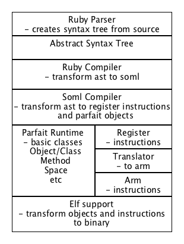

# Object Machine

The state of the object machine is completely defined by objects, in the same way a the state
of a c machine is defined by its memory. We will see below what objects, and how they are created.
We use classes in the design, but a program running on the machine may work with just objects
in a sort of javascript way if it wants to.

Above is a basic diagram of the machine architecture. The following subchapters will detail many of
the aspects shown in more detail.

But the main thing to understand is that a dynamic object machine requires a relatively large
run-time. In an object oriented system, this means both data (objects) and functionality (functions).
And the easiest way to achieve the generation of the required
objects is to reuse the run-time at compile-time.
This will be explained in the second sub-chapter.

The first sub-chapter defines the runtime, our class system and that will be available for edit
at runtime to achieve the desired dynamic behavior.
Then we will define the methods are represented and called. This will lead to the objects the
machine actually works on, mostly Messages.

The next subchapter then talks about Bootstrapping the system, and how it is that we can use the
runtime at compile-time even they are written in different languages.

### Language independent

We define the machine language independent, and aim to be general in a way as to allow many,
or at least several major, languages to be implemented using it. But for the details,
the implementation is needed, and off course any implementation needs to be in some language.
The first implementation language will be ruby, or rather a subset thereof.
