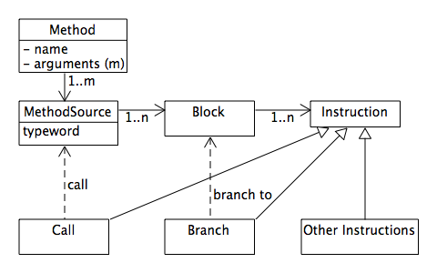

## Methods

As we have seen in the previous chapter, the object machines objects contain,
as their instance variables, binary data and methods. Off course, in an object oriented system,
the distinction is not so great, as methods are represented as objects too.

From a programs perspective the Method object is quite opaque and it is mostly
the name that is interesting. Methods are callable and that is what matters.
But for the machine the structure is essential to the working of the machine.
And how methods actually provide the callable functionality is the topic of the rest of this chapter.
The diagram below gives an overview of the classes involved.

### Blocks

The idea of Methods is that they are jumpable and execute code.
In the object machine Code is represented as a sequence of instructions.
The exact definition of the Instructions will be a subsequent chapter,
here we just want to explain the parts of the hierarchy that pertains to flow control,
as this influences the structure of the Method.

We can see from the diagram that the Call instruction holds a reference to a Method,
obviously the method that is to be executed when the instruction is executed.
But to implement control structures we also need a jump or Branch instruction.
Branches have been banned from programming languages, where they are often called goto,
for a good reason, namely they are so low level as to be difficult to understand.
Instead languages use higher level control structures. But to implement these control structures,
we do need a Branch, and so we also need a place for a branch to branch too.
In assembler these places are called labels.

If one looks at instruction sequences from a control flow perspective they fall
into little linear chunks, interspersed by calls and branches. We call such a
linear sequence of instructions a Block, and with that we can see that only
Blocks are legal points to branch to.

So a Branch instruction holds a reference of the Block it jumps to.
A Block in turn is a linear sequence of Instructions and if it contains a Call
or Branch instruction it does so as it's last instruction.
Methods hold a sequence of Blocks, and if a Block does not call or branch,
control flows implicitly to the next Block.

### Calling

Quite apart from the details of how we generate instructions and their structure,
above class design lets us clearly implement control structures and function calling.
But it does not explain how a function call would actually happen, just how the instruction is defined.

To understand function calling, let us look very briefly at how this is done at the cpu level,
and what the c machine does. While branching just transfers control,
calling transfers control with the intent to resume after the call.
That means the address where control resumes is needed.
Many cpus push the return address onto a system stack, but some, like arm, store it in a designated register.
This shows how the return is really a hidden argument to the function,
much in the same way that the object (self) is  a hidden parameter in object oriented languages.

The c machine, implemented by the compiler, uses registers, the stack or a combination of them,
depending on cpu, to pass function arguments. If a function uses local variables,
these are usually stored on the stack, and the area designated for this is called the frame.
All this moving about of data to and from registers and the stack is what lets the programmer
deal in the language concepts, essentially is the implementation of the c machine.

Off course we need to pass objects in the object machine too, and it is quite straightforward
to define an array for this. The question is more how to pass the implicit information,
since we want to do this too in an object oriented fashion.

#### Message

Because the function must often be resolved at run-time, one often speaks of sending messages
in object oriented languages. So to make all information passed explicit, in an oo fashion,
we define a Message class with the following attributes:

- Name, the name of the function to be called on the *receiver*
- *receiver* , the object receiving the message
- arguments, an array object containing the arguments in order. Arguments are typed values as described above.
- return address
- exceptional return address
- Frame object for local and temporary variables

A Message is the basis for message sending that is the basis of object oriented programming.
Sending a message involves finding the right Method and calling that. So all sending boils down to
calling a method.

#### Calling

Calling a Method is quite simple: We acquire a message (see below) and fill in the data, arguments,
method name and receiver. On the vm level we use an instruction to call the method. At
register level this gets resolved to a machine call to the binary code.

#### Sending

Sending a message involves a little more than the calling described above, but from a vm
instruction level it is actually very similar. We gather arguments, message name and receiver.
But instead of a Call Instruction we issue a Send Instruction.

The implementation of the send instruction is one of the few that actually happens at the vm
level. As mentioned, we need to find the function to call, and if we can not find any, we call
*method_missing*. So we always resolve a Send to a Call.

### Static Message Chain

An interesting and not immediately obvious consequence of this design is the ease with which it is
implemented. Specifically all message may be created at runtime and linked into a double linked
list. The forward link lest us easily make a new message available, and te backward link let's us
return the previous state.

Especially programmers who may think of call graphs, may woder why no dynamic, or run-time, work is
required here. Why a list is enough and not a graph needed.
Maybe the easiest way to understand this is by anlogy to the c world. C uses a stack, ie an array,
not a linked list. But the important thing is that the stack is also allocated at compile-time and
does not change. Or it may have to be extended when space runs out, but that is not covered in this
discussion (neither for the messages).

Making a new message available is thus really easy and that does off course mean fast. All we need
to do is follow the link of the list, so in essences one cpu instruction.

### Exceptions

As we have seen, the return address of a regular return is a hidden argument in the Message.
To implement exceptions we need to be able to "return" to a point across several function
invocations, but in essence it is the same thing. We store the last exception address in the Message.
This may be changed and setting it is equivalent to the language concept catch that many languages have.
If it is not set in a Method, a raise will traverse the Message chain until it finds
a Message where it is set and return to that point.

A side effect of this object oriented design is the ease with which such a raise/catch may be
implemented. We do not need to unwind any cryptic stack frames or free any memory or indeed
keep book of anything to be freed or cleaned up. Only the Message data, especially arguments
needs to be zeroed for garbage collection to work properly.
