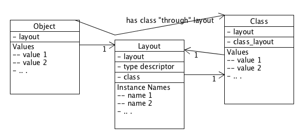

## Classes and Values

In our design, objects are made up of Values. We will define Values in a little, but just to clarify,
objects do not contain other objects, only references. In other words true aggregation of objects
is not supported, only association.

Another common feature for all objects is that they have a class, and without using class
inheritance this will default to Object. Unlike other designs, we do not store the class directly
in the object, but use a class called Layout as a mediator. Still, the normal object oriented
assumption is enforced, namely that the class of an object may not be changed during it's life-cycle.
More about the Layout below.

### Values

In the machine design we make the distinction between objects and values explicit.
Values may be easiest to understand in terms of the implementation, they are stored in a machine word.
Conceptually they represent different entities from objects, as

- they can not be changed
- same means identical ie == and === always resolve to the same
- they can not have instance variables

Values have type, and this type is known at run-time. As we mentioned in the first chapter,
early implementations used to tag the machine word with a bit, signaling this type.
This works for the minimal two basic types of integer and reference but has several drawbacks, it:

- is not extensible. It uses a bit to store a possible of two values. One could arguably use more
  bits, but that would increase below issues, while not resolving all
- makes  data exchange difficult, as external api's may use the full width of the word, not minus
  one bit. In network traffic and operating system calls this can cause problems
- can never work for floats, as floats use the whole of the machine word in a way that it is not
  easy to pinch a bit.
- incurs a high run-time cost for masking, unmasking and type checking.

All four of those points are unacceptable, and so we choose to encode the value's type in an
external (though implict) fashion. This is explained in the layout section below.

To repeat, objects are made up of values. Values are represented by immutable binary patterns that
are nevertheless typed. In our implementation value types are stored external to the value,
but in a silicon implementation it would be beneficial to store the type with the value.

### Layout and Class

Traditionally objects have a minimum of one association, the class. In some systems the class serves
the double role of specifying what variables/methods an object has and how those are arranged.
We nevertheless want to design an open system, so it should be possible to add instance variables
and methods to objects at run-time. And while it is possible to add this to classes dynamically,
it can easily be somewhat imprecise (having some objects of a class that have a certain variable,
but others not), and easily inefficient (when changing all objects of a class to hold nil values, eg).

Instead of associating the object with it's Class directly, we associate it with it's Layout and
the Layout with the Class it represents. The diagram below illustrates this,
as an object (not class) diagram.

Each object has a reference to the layout for this Object. But the layout defines the types
, and if applicable, names that the object holds. An object *may* hold
any amount of instance variables (logically).
The Layout, being an Object, also has a layout (with type info), but detail is omitted here for clarity.
The objects Layout holds the names of all the objects instance variables. The Layout also holds a
reference to the class for the Object.

As we want a flexible design, the Class object is mutable at any time. The programmer may add,
or remove variables and methods, even change the inheritance of the class. But it is important
to note that the Layout is **immutable**. This means that when the programmer adds an instance
variable, a **new** Layout is created. This is so that the Layout of other existing objects stays
valid, and off course if or when there are no such other objects the layout will be collected.

### Implicit type

To understand the Type system as outlined above, it helps to consider the c model: in c all data
is typed at compile-time, but no type information is available at run-time. The types are **implicit**
in the code: meaning the code knows how to handle the types without explicit type information checks.
While normal in static languages, it is different from dynamic object oriented systems, like
ruby or smalltalk, that explicitly store type information as a bit of every value.
And since some operations are not allowed on one type while
allowed on another, the system checks before applying an operation. Added to the checking effort is
usually added the effort of wrapping and unwrapping the value from it's store representation to the
natural one (ie bit masking in mri).

Soml keeps type information **implicitly** in a similar spirit to c. As all types of all values
of all object are known at compile time, salama knows from the start what types are where.
When a change of type happens, the code (rather than the explicit type information) that is
used is changed. This uses more space (for the extra code), but
is faster as long as the basic assumption that types don't change too much holds.

It is at any moment like the c model, that is until change happens. Change of type can really only
happen at the method boundary, and this is where the object machine is very different from c.
Different code paths are taken for different types both on entering and exiting functions.
Details of this are explained in the next chapter.

### Meta and Eigenclass

To understand the concepts of Meta and Eigenclass it helps to look at what a Class is for.
Instead of defining methods on each object separately, as some languages do, a Class lets
us define methods for a whole group, or class, of objects. The class has a name and it may
derive methods from super-classes, but mainly the class syntax lets us define methods for
a group of objects, not single objects. To implement a machine, it is necessary to define
methods on single objects, and to fit that with the class idea, it is necessary to have
classes that have just one instance (or at least seem to).

The Meta-class was introduced in Smalltalk as the class that is the class of the class of an object.
Instances of Meta-classes were classes and each class had it's own meta-class.
Such is was possible to use the class concept to define methods on singleton objects.
As was realized in ruby, this was unnecessarily complicated as the meta-class is more a concept,
and the only meta-class needed is the Class object.

For our machine we define the Eigenclass of an object to be the object.
Thus any object may act itself in some ways as a class, and the way it does this
is by having instance variables that are Methods. We will define Methods precisely
in the next chapter, but as the name says, they represent callable objects that hold executable code.

When this idea of the Eigenclass is applied to Class instances, we can see that class methods
are in fact methods defined in the class object. Much in the same way as class variables
are instance variables on the class object.

To realize this idea of the Eigenclass we extend the traditional definition of an object.
Instead of just holding instance data and a class reference, an object may have instance variables,
instance methods, and the class reference.
To resolve a method we will start with the objects instance methods, before proceeding to the
class and up the tree.
