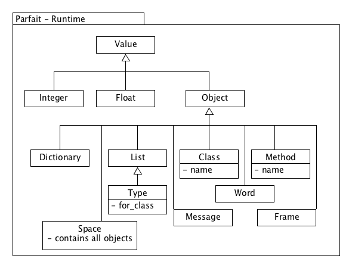

## Parfait

A dynamic object machine allows the programmer to access everything of the machine at run-time,
through  a well defined api. Even for a minimal system this requires Classes,
Methods basic numeric integers and with supporting classes we come to the diagram below.

The diagram leaves out all detail of associations and functionality for clarity. We will go into
all the aspects as needed in further chapters.

Some basic classes, List, Dictionary, Word, Integer and Float are just what you would expect and
won't be covered. The only exception here is that Integer and Float are not modeled as objects as
in other systems, but rather as an even more base class called Value, which we will go into in
the next chapter.

### The Run-time

The diagram above is represented as the run-time part of our object machine and so one could think
that it would be written in the higher level language that we want run. But it is not, instead
it is written in system language that we will introduce in the next chapter.

But the run-time is (off course) accessible to the programmer of the higher language, but how
this is achieved will be covered in the next chapter. The important thing at this point is only
to note that all the classes described here are statically typed, and most of the functionality
can not be changed at run-time as the working of the machine depend on it.
It is a very small core though, and it can always be changed and re-compiled, so while change is
not immediate, it is quite possible with time.
