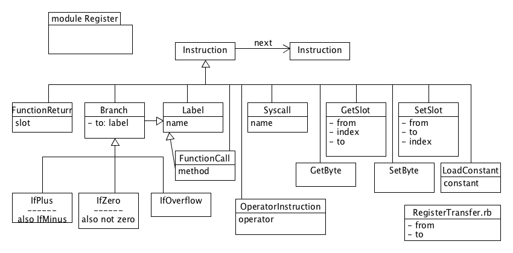

## Instruction Set

This chapter will define the instructions of the Register Machine.
As we do not yet have a second implementation other than arm, the main benefit of this
is to define meaningful names for the actions/instructions of the abstract machine so
we can better understand what it does. The next layer, the arm machine,
is on purpose quite close to assembler, to make it easier to work with existing documentation.
This does mean though that the names used are traditionally cryptic.

As this is not the focus of the book, we will keep it short and refer to the actual code for more
details.

The general rule for data moving instructions is *from -> to*. This may be the other way around
from some assembler notations, but it is more natural.

The instructions fall into several categories, data movement, control flow, arithmetic and system call.

### Data movement

#### GetSlot

GetSlot moves what is essentially an instance variable (the slot) to a register.

GetSlot uses an object reference and an index that describes the slot. And a Register to which that
data is moved. The index may be an integer constant or a register name.

#### SetSlot

SetSlot is in essence the reverse of GetSlot, it stores data, given as a register name,
at the offset into the referred object.

#### Get and SetByte

Get and Set byte are very similar to the Get and SetSlot instructions, but as the name suggests
they only transfer a byte, not a machine word. These instructions are interesting manly for
byte buffers and string manipulation, whereas Get and Set slot make the whole oo machinery work.

##### RegisterTransfer

RegisterTransfer copies data from one register to another.

#### LoadConstant

Load the given Constant into the given register. Constants may be object references or integers.
Object references are loaded in a position independent way by calculating offsets to the pc.

### Control Flow

#### Branch

Branch is the base class for all Branches. The base class represents the unconditional branch, or
jump.

Branches must jump to labels. Labels mark the start of methods and also statements when they are
needed.

#### Conditional Branches

There are five derived classes from Branch which represent conditional Branches. The names IfZero,
IfNotzero, IfPlus , IfMinus and IfOverflow pretty much explain the conditions.

Like in cpu's the model is that the previous instruction sets the flags that the names suggest and
the branch tests the flags.

#### FunctionCall

A Function call is really an unconditional branch in this model. The class holds a reference to the
method, and the jump is to the start label of the method.

Nothing else is implied in the instruction, the compiler (not the runtime) sets up the return
address in the message.

#### FunctionReturn

Also a FunctionReturn is really an unconditional jump. It takes as it's target a Slot, much like the
GetSlot (a register and an index). The instruction retrieves the address from the slot and jumps to
it.

This makes the caller responsible for setting up the return address, which in a normal call is the
label following the call.

### Arithmetic

Arithmetic, the operation on integers, are modeled as a single instruction, the
**OperatorInstruction**. The OperatorInstruction takes two registers and the operator symbol.

The result of the operation is left in the first register, so the operation is destructive.

Notice also that since two registers are required, and constants will have to be loaded before.
At the cpu level there are usually more efficient ways of doing this, but we leave that as an
optimisation. This makes the model interaction with expressions much cleaner.

### System Call

The System calls is not listed under flow control, because from the register machine level
perspective it is a linear operation. It is in fact closer to the OperatorInstruction albeit
with possibly more registers, in that it resolves the registers to a result, stored in register 0.

Since Register 0 is the pinned Message, the implementation takes care to move the massage out of
the way before the syscall and back after.

The Syscall holds only a name describing the action. Resolving the name to an number for a specific
os is part of the implementation.
